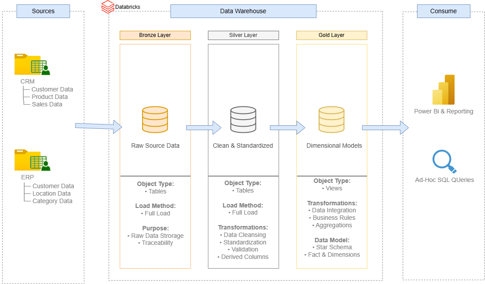
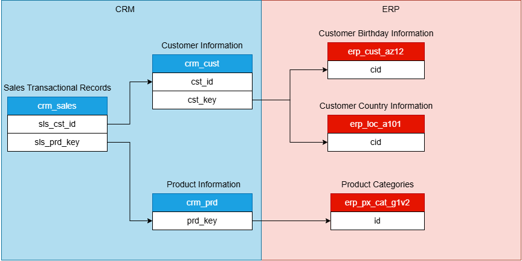
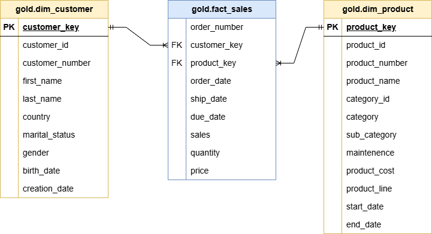

# Enterprise Data Warehouse

An end-to-end data warehouse built in Databricks using a Medallion Architecture (Bronze, Silver, and Gold). This project integrates ERP and CRM data into a centralized analytics platform and transforms raw operational data into business-ready dimensional models.

## Project Overview

Organizations often store data across multiple systems, making reporting difficult and leading to inconsistent business metrics. This project addresses that challenge by building a modern data warehouse that ingests, cleans, validates, and models data for analytics and reporting.

## Key Objectives

- Integrate ERP and CRM data into a unified platform
- Improve data quality through cleansing, validation, and standardization
- Implement a Medallion Architecture with Bronze, Silver, and Gold layers
- Build star schema dimension and fact tables for analytics
- Support downstream reporting and business intelligence tools

## Architecture

- **Bronze Layer** – Raw data ingestion from source systems into Delta tables
- **Silver Layer** – Data cleansing, standardization, validation, and business rule application
- **Gold Layer** – Analytics-ready star schema consisting of customer and product dimensions with a sales fact table

*Architecture Diagram Here*

## Source System Data Model

The warehouse integrates data from separate CRM and ERP source systems. The diagram below illustrates the relationships between the source entities used throughout the ETL process.

## Gold Layer Data Model

The Gold layer is modeled as a star schema:

- `dim_customer` – Customer attributes and demographics
- `dim_product` – Product and category information
- `fact_sales` – Sales transactions linked to customer and product dimensions through surrogate keys

## Tech Stack

- Databricks
- Apache Spark (PySpark)
- Spark SQL
- Delta Lake
- Power BI
- Draw.io
- Git & GitHub

## Documentation

- Business Requirements
- Architecture Design
- Star Schema
- ETL Process
